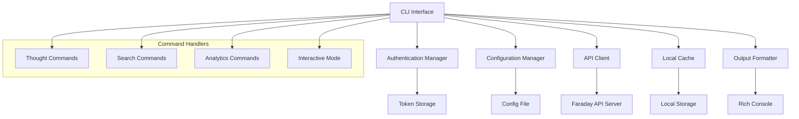

# Faraday CLI Design Document

## Overview

The Faraday CLI is a Python-based command-line interface that provides a rich, interactive experience for managing thoughts and performing semantic searches. Built using Click framework for command handling and Rich library for beautiful terminal output, it offers both simple commands and an interactive mode for power users.

## Architecture

### High-Level Architecture



### Core Components

1. **CLI Framework**: Click-based command structure with subcommands
2. **API Client**: HTTP client for communicating with Faraday API
3. **Authentication Manager**: JWT token handling and storage
4. **Configuration Manager**: Settings and preferences management
5. **Output Formatter**: Rich-based beautiful terminal output
6. **Local Cache**: SQLite-based offline storage
7. **Interactive Shell**: REPL-style interactive mode

## Components and Interfaces

### 1. CLI Entry Point (`cli/main.py`)

```python
@click.group()
@click.option('--config', help='Config file path')
@click.option('--api-url', help='API server URL')
@click.option('--json', is_flag=True, help='Output JSON')
@click.pass_context
def cli(ctx, config, api_url, json):
    """Faraday Personal Semantic Engine CLI"""
    ctx.ensure_object(dict)
    ctx.obj['config'] = ConfigManager(config)
    ctx.obj['api_client'] = APIClient(api_url or ctx.obj['config'].api_url)
    ctx.obj['json_output'] = json
```

### 2. API Client (`cli/api_client.py`)

```python
class APIClient:
    def __init__(self, base_url: str):
        self.base_url = base_url
        self.session = httpx.AsyncClient()
        self.auth_token = None
    
    async def create_thought(self, content: str, metadata: dict = None) -> dict
    async def search_thoughts(self, query: str, filters: dict = None) -> dict
    async def get_thoughts(self, limit: int = 20, offset: int = 0) -> dict
    async def authenticate(self, email: str, password: str) -> str
    async def get_user_stats() -> dict
```

### 3. Authentication Manager (`cli/auth.py`)

```python
class AuthManager:
    def __init__(self, config_dir: Path):
        self.token_file = config_dir / "token"
    
    def save_token(self, token: str) -> None
    def load_token(self) -> Optional[str]
    def clear_token(self) -> None
    def is_authenticated(self) -> bool
    def get_auth_headers(self) -> dict
```

### 4. Configuration Manager (`cli/config.py`)

```python
class ConfigManager:
    def __init__(self, config_path: Optional[str] = None):
        self.config_path = Path(config_path or "~/.faraday/config.toml")
        self.config = self._load_config()
    
    def get(self, key: str, default=None) -> Any
    def set(self, key: str, value: Any) -> None
    def save(self) -> None
    def reset(self) -> None
```

### 5. Output Formatter (`cli/output.py`)

```python
class OutputFormatter:
    def __init__(self, console: Console, json_mode: bool = False):
        self.console = console
        self.json_mode = json_mode
    
    def format_thought(self, thought: dict) -> None
    def format_search_results(self, results: dict) -> None
    def format_stats(self, stats: dict) -> None
    def format_table(self, data: List[dict], headers: List[str]) -> None
    def format_error(self, error: str) -> None
```

### 6. Local Cache (`cli/cache.py`)

```python
class LocalCache:
    def __init__(self, cache_dir: Path):
        self.db_path = cache_dir / "cache.db"
        self.init_db()
    
    def cache_thought(self, thought: dict) -> None
    def get_cached_thoughts(self, limit: int = 20) -> List[dict]
    def search_cached_thoughts(self, query: str) -> List[dict]
    def sync_with_server(self, api_client: APIClient) -> None
    def clear_cache(self) -> None
```

## Data Models

### Configuration Schema

```toml
[api]
url = "http://localhost:8001"
timeout = 30

[auth]
auto_login = true
remember_token = true

[output]
colors = true
pager = "auto"
max_results = 20

[cache]
enabled = true
max_size_mb = 100
sync_interval = 300
```

### Thought Display Format

```
┌─ Thought #abc123 ─────────────────────────────────────────┐
│ 📝 I had an amazing coffee meeting with Sarah today...    │
│                                                           │
│ 🏷️  Tags: work, meeting, AI                              │
│ 😊 Mood: excited                                          │
│ 📅 Created: 2024-01-15 14:30                             │
│                                                           │
│ 🧠 Entities: Sarah (PERSON), AI project (TOPIC)          │
│ 🔗 Related: 3 similar thoughts                           │
└───────────────────────────────────────────────────────────┘
```

### Search Results Format

```
🔍 Search: "coffee meetings" (3 results)

┌─ 95% Match ─ Thought #abc123 ─────────────────────────────┐
│ I had an amazing coffee meeting with Sarah today...       │
│ 📅 2024-01-15  🏷️ work, meeting  😊 excited             │
└───────────────────────────────────────────────────────────┘

┌─ 87% Match ─ Thought #def456 ─────────────────────────────┐
│ Coffee with the team was productive, discussed...         │
│ 📅 2024-01-10  🏷️ team, planning  😐 neutral            │
└───────────────────────────────────────────────────────────┘
```

## Error Handling

### Error Categories

1. **Network Errors**: Connection failures, timeouts
2. **Authentication Errors**: Invalid credentials, expired tokens
3. **Validation Errors**: Invalid input, missing required fields
4. **Server Errors**: API errors, internal server errors
5. **Local Errors**: File system issues, cache corruption

### Error Display Strategy

```python
def handle_error(error: Exception, formatter: OutputFormatter):
    if isinstance(error, NetworkError):
        formatter.format_error("🌐 Network error: Check your connection")
    elif isinstance(error, AuthenticationError):
        formatter.format_error("🔐 Authentication failed: Please login again")
    elif isinstance(error, ValidationError):
        formatter.format_error(f"❌ Invalid input: {error.message}")
    else:
        formatter.format_error(f"💥 Unexpected error: {error}")
```

## Testing Strategy

### Unit Tests

- **Command Handlers**: Test each command with various inputs
- **API Client**: Mock HTTP responses and test error handling
- **Authentication**: Test token storage and validation
- **Configuration**: Test config loading, saving, and validation
- **Output Formatting**: Test various output formats and edge cases

### Integration Tests

- **End-to-End Commands**: Test complete command workflows
- **API Integration**: Test against real Faraday API server
- **Cache Synchronization**: Test offline/online mode transitions
- **Interactive Mode**: Test REPL functionality

### Test Structure

```
tests/
├── unit/
│   ├── test_commands.py
│   ├── test_api_client.py
│   ├── test_auth.py
│   ├── test_config.py
│   └── test_output.py
├── integration/
│   ├── test_end_to_end.py
│   ├── test_api_integration.py
│   └── test_interactive.py
└── fixtures/
    ├── sample_thoughts.json
    └── mock_responses.py
```

## Command Structure

### Primary Commands

```bash
faraday add "content" [--mood MOOD] [--tags TAG,TAG] [--meta KEY=VALUE]
faraday list [--limit N] [--mood MOOD] [--tags TAG] [--since DATE]
faraday search "query" [--limit N] [--mood MOOD] [--tags TAG]
faraday show <thought-id>
faraday delete <thought-id>
faraday login [--email EMAIL]
faraday logout
faraday config <get|set|show|reset> [KEY] [VALUE]
faraday stats [--period PERIOD]
faraday export <filename> [--format FORMAT]
faraday import <filename>
faraday interactive
faraday sync
```

### Interactive Mode Commands

```
> add: Had a great idea about machine learning
> search: machine learning projects
> show: abc123
> stats
> help
> exit
```

## Implementation Plan

### Phase 1: Core CLI Framework
- Set up Click-based command structure
- Implement basic configuration management
- Create API client with authentication
- Add basic thought CRUD operations

### Phase 2: Rich Output and Search
- Integrate Rich library for beautiful output
- Implement search functionality
- Add output formatting for different data types
- Create error handling system

### Phase 3: Advanced Features
- Build interactive mode
- Add local caching and offline support
- Implement analytics and stats commands
- Create export/import functionality

### Phase 4: Polish and Plugins
- Add comprehensive testing
- Implement plugin system
- Create documentation and examples
- Performance optimization

## Dependencies

### Core Dependencies
- **click**: Command-line interface framework
- **rich**: Rich text and beautiful formatting
- **httpx**: Modern HTTP client for API calls
- **pydantic**: Data validation and settings
- **toml**: Configuration file parsing
- **sqlite3**: Local caching (built-in)

### Development Dependencies
- **pytest**: Testing framework
- **pytest-asyncio**: Async testing support
- **pytest-mock**: Mocking utilities
- **black**: Code formatting
- **mypy**: Type checking

## Deployment and Distribution

### Package Structure
```
faraday-cli/
├── pyproject.toml
├── README.md
├── src/
│   └── faraday_cli/
│       ├── __init__.py
│       ├── main.py
│       ├── commands/
│       ├── api/
│       ├── auth/
│       ├── config/
│       ├── output/
│       └── cache/
└── tests/
```

### Installation Methods
1. **PyPI Package**: `pip install faraday-cli`
2. **Homebrew**: `brew install faraday-cli`
3. **Binary Releases**: Standalone executables for major platforms
4. **Docker**: Containerized version for consistent environments

### Configuration Locations
- **Linux/macOS**: `~/.config/faraday/`
- **Windows**: `%APPDATA%/faraday/`
- **Override**: `--config` flag or `FARADAY_CONFIG` environment variable