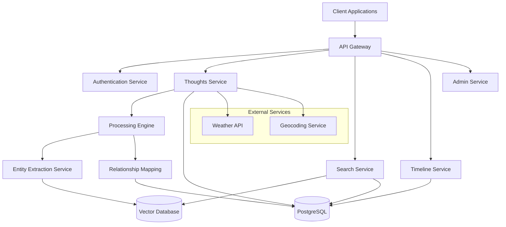
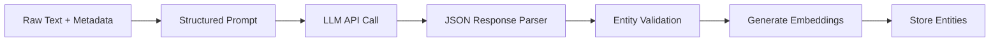

# Design Document - Personal Semantic Engine (Faraday)

## Overview

The Personal Semantic Engine (Faraday) is designed as a microservices-based API system that transforms unstructured personal thoughts into a searchable, semantic knowledge graph. The system employs natural language processing to extract entities and relationships, stores data in both relational and vector databases for optimal search performance, and provides RESTful APIs for all interactions.

### Key Design Principles

- **Clean Architecture**: Domain-driven design with clear separation between interfaces and implementations
- **API-First Architecture**: All functionality exposed through well-documented REST endpoints
- **Dependency Inversion**: Abstract interfaces allow easy swapping of implementations (PostgreSQL ↔ Redis, NLP ↔ LLM)
- **Semantic Understanding**: LLM-based entity extraction for v0, with pluggable architecture for future NLP alternatives
- **Scalable Storage**: Hybrid database approach with abstracted repository pattern
- **Privacy by Design**: End-to-end encryption and user data isolation
- **Extensible Framework**: Modular design to support future external API integrations

## Architecture

### High-Level Architecture



### Service Architecture

The system follows a microservices pattern with the following core services:

1. **API Gateway**: Request routing, rate limiting, and API documentation
2. **Authentication Service**: User management and JWT token handling
3. **Thoughts Service**: Input processing and metadata enrichment
4. **Processing Engine**: Entity extraction and semantic analysis (LLM-based for v0)
5. **Search Service**: Semantic search and filtering capabilities
6. **Timeline Service**: Chronological data visualization
7. **Admin Service**: System administration and user management

## Clean Architecture Implementation

### Domain Layer (Core Business Logic)
```typescript
// Domain Interfaces - No external dependencies
interface ThoughtRepository {
  save(thought: Thought): Promise<Thought>;
  findById(id: string): Promise<Thought | null>;
  findByUserId(userId: string, pagination: Pagination): Promise<Thought[]>;
  delete(id: string): Promise<void>;
}

interface EntityExtractionService {
  extractEntities(content: string, metadata?: any): Promise<SemanticEntry[]>;
}

interface SearchRepository {
  indexThought(thought: Thought, entities: SemanticEntry[]): Promise<void>;
  search(query: SearchQuery): Promise<SearchResult[]>;
}

interface VectorStore {
  store(id: string, vector: number[], metadata: any): Promise<void>;
  search(vector: number[], filters?: any): Promise<VectorSearchResult[]>;
}
```

### Application Layer (Use Cases)
```typescript
class CreateThoughtUseCase {
  constructor(
    private thoughtRepo: ThoughtRepository,
    private entityExtractor: EntityExtractionService,
    private searchRepo: SearchRepository
  ) {}

  async execute(input: CreateThoughtInput): Promise<Thought> {
    // Business logic orchestration
    const thought = new Thought(input);
    const entities = await this.entityExtractor.extractEntities(thought.content, thought.metadata);
    
    const savedThought = await this.thoughtRepo.save(thought);
    await this.searchRepo.indexThought(savedThought, entities);
    
    return savedThought;
  }
}
```

### Infrastructure Layer (Implementations)
```typescript
// Swappable implementations
class PostgreSQLThoughtRepository implements ThoughtRepository {
  // PostgreSQL specific implementation
}

class RedisThoughtRepository implements ThoughtRepository {
  // Redis specific implementation
}

class LLMEntityExtractionService implements EntityExtractionService {
  // OpenAI/Anthropic LLM implementation
}

class SpaCyEntityExtractionService implements EntityExtractionService {
  // spaCy NLP implementation
}
```

### Dependency Injection Configuration
```typescript
// Easy to swap implementations
const container = {
  thoughtRepository: new PostgreSQLThoughtRepository(), // or RedisThoughtRepository
  entityExtractor: new LLMEntityExtractionService(),    // or SpaCyEntityExtractionService
  vectorStore: new PineconeVectorStore(),               // or WeaviateVectorStore
};
```

## Components and Interfaces

### Core Data Models

#### Thought Model
```typescript
interface Thought {
  id: string;
  userId: string;
  content: string;
  timestamp: Date;
  metadata: {
    location?: GeoLocation;
    weather?: WeatherData;
    mood?: string;
    tags?: string[];
  };
  semanticEntries: SemanticEntry[];
  createdAt: Date;
  updatedAt: Date;
}
```

#### Semantic Entry Model
```typescript
interface SemanticEntry {
  id: string;
  thoughtId: string;
  entityType: EntityType;
  entityValue: string;
  confidence: number;
  context: string;
  relationships: Relationship[];
  embedding: number[]; // Vector representation
  extractedAt: Date;
}
```

#### Entity Types
```typescript
enum EntityType {
  PERSON = 'person',
  LOCATION = 'location',
  DATE = 'date',
  ACTIVITY = 'activity',
  EMOTION = 'emotion',
  ORGANIZATION = 'organization',
  EVENT = 'event'
}
```

### API Endpoints

#### Thoughts API
- `POST /api/v1/thoughts` - Create new thought entry
- `GET /api/v1/thoughts` - List user's thoughts with pagination
- `GET /api/v1/thoughts/{id}` - Get specific thought
- `PUT /api/v1/thoughts/{id}` - Update thought
- `DELETE /api/v1/thoughts/{id}` - Delete thought

#### Search API
- `POST /api/v1/search` - Semantic search with filters
- `GET /api/v1/search/suggestions` - Get search suggestions
- `GET /api/v1/entities` - List extracted entities with filters

#### Timeline API
- `GET /api/v1/timeline` - Get chronological view with date range
- `GET /api/v1/timeline/summary` - Get timeline summary statistics

#### Admin API
- `GET /api/v1/admin/users` - List users (admin only)
- `POST /api/v1/admin/users` - Create user (admin only)
- `GET /api/v1/admin/health` - System health check

### Entity Extraction Pipeline

#### LLM-Based Entity Extraction (v0 Implementation)


**Technology Stack for v0:**
- **Primary**: OpenAI GPT-4 or Anthropic Claude for entity extraction
- **Embeddings**: OpenAI text-embedding-ada-002 for semantic similarity
- **Fallback**: Structured prompting with retry logic
- **Future**: Pluggable architecture allows switching to spaCy/custom NLP models

#### LLM Prompt Strategy
```typescript
interface EntityExtractionPrompt {
  systemPrompt: string;
  userPrompt: string;
  expectedFormat: {
    entities: Array<{
      type: EntityType;
      value: string;
      confidence: number;
      context: string;
    }>;
    relationships: Array<{
      source: string;
      target: string;
      type: string;
    }>;
  };
}

const ENTITY_EXTRACTION_PROMPT = `
Extract entities from the following personal thought/note. 
Focus on: people, locations, dates, activities, emotions, organizations, events.
Return structured JSON with confidence scores (0-1).
Consider the provided metadata context (location, weather, etc.).
`;
```

#### Relationship Mapping
- **LLM-Based Relationships**: Extract relationships directly from LLM analysis
- **Co-occurrence Analysis**: Identify entities mentioned together
- **Temporal Relationships**: Link entities across time using timestamps
- **Semantic Similarity**: Connect similar concepts using embeddings
- **User Patterns**: Learn user-specific relationship patterns over time

#### Implementation Flexibility
```typescript
// Abstract interface allows easy swapping
interface EntityExtractionService {
  extractEntities(content: string, metadata?: any): Promise<SemanticEntry[]>;
}

// v0: LLM Implementation
class LLMEntityExtractionService implements EntityExtractionService {
  async extractEntities(content: string, metadata?: any): Promise<SemanticEntry[]> {
    const prompt = this.buildPrompt(content, metadata);
    const response = await this.llmClient.complete(prompt);
    return this.parseEntities(response);
  }
}

// Future: NLP Implementation
class NLPEntityExtractionService implements EntityExtractionService {
  async extractEntities(content: string, metadata?: any): Promise<SemanticEntry[]> {
    // spaCy or other NLP library implementation
  }
}
```

## Data Models

### Database Schema Design

#### PostgreSQL Schema
```sql
-- Users table
CREATE TABLE users (
    id UUID PRIMARY KEY DEFAULT gen_random_uuid(),
    email VARCHAR(255) UNIQUE NOT NULL,
    password_hash VARCHAR(255) NOT NULL,
    created_at TIMESTAMP DEFAULT NOW(),
    updated_at TIMESTAMP DEFAULT NOW()
);

-- Thoughts table
CREATE TABLE thoughts (
    id UUID PRIMARY KEY DEFAULT gen_random_uuid(),
    user_id UUID REFERENCES users(id) ON DELETE CASCADE,
    content TEXT NOT NULL,
    metadata JSONB,
    timestamp TIMESTAMP NOT NULL,
    created_at TIMESTAMP DEFAULT NOW(),
    updated_at TIMESTAMP DEFAULT NOW()
);

-- Semantic entries table
CREATE TABLE semantic_entries (
    id UUID PRIMARY KEY DEFAULT gen_random_uuid(),
    thought_id UUID REFERENCES thoughts(id) ON DELETE CASCADE,
    entity_type VARCHAR(50) NOT NULL,
    entity_value TEXT NOT NULL,
    confidence DECIMAL(3,2) NOT NULL,
    context TEXT,
    extracted_at TIMESTAMP DEFAULT NOW()
);

-- Relationships table
CREATE TABLE entity_relationships (
    id UUID PRIMARY KEY DEFAULT gen_random_uuid(),
    source_entity_id UUID REFERENCES semantic_entries(id),
    target_entity_id UUID REFERENCES semantic_entries(id),
    relationship_type VARCHAR(50) NOT NULL,
    strength DECIMAL(3,2) NOT NULL,
    created_at TIMESTAMP DEFAULT NOW()
);
```

#### Vector Database Schema (Pinecone/Weaviate)
```typescript
interface VectorEntry {
  id: string;
  vector: number[]; // 768-dimensional embedding
  metadata: {
    userId: string;
    thoughtId: string;
    entityType: string;
    entityValue: string;
    timestamp: string;
    confidence: number;
  };
}
```

### Search Index Strategy

#### Hybrid Search Approach
1. **Vector Search**: Semantic similarity using embeddings
2. **Full-Text Search**: Traditional keyword matching
3. **Metadata Filtering**: Structured data filtering
4. **Temporal Ranking**: Recency-based scoring

#### Search Scoring Algorithm
```typescript
interface SearchScore {
  semanticSimilarity: number; // 0-1 from vector similarity
  keywordMatch: number; // 0-1 from text matching
  recencyScore: number; // 0-1 based on timestamp
  confidenceScore: number; // 0-1 from entity extraction confidence
  finalScore: number; // Weighted combination
}
```

## Error Handling

### Error Response Format
```typescript
interface ErrorResponse {
  error: {
    code: string;
    message: string;
    details?: any;
    timestamp: string;
    requestId: string;
  };
}
```

### Error Categories
- **Validation Errors** (400): Invalid input data
- **Authentication Errors** (401): Invalid or missing credentials
- **Authorization Errors** (403): Insufficient permissions
- **Not Found Errors** (404): Resource not found
- **Rate Limit Errors** (429): Too many requests
- **Processing Errors** (422): NLP processing failures
- **Server Errors** (500): Internal system errors

### Retry Strategy
- **Exponential Backoff**: For external API calls
- **Circuit Breaker**: For NLP service failures
- **Graceful Degradation**: Fallback to simpler processing when advanced NLP fails

## Testing Strategy

### Unit Testing
- **Service Layer**: Business logic and data transformations
- **Repository Layer**: Database operations and queries
- **NLP Pipeline**: Entity extraction accuracy and performance
- **API Endpoints**: Request/response validation

### Integration Testing
- **Database Integration**: End-to-end data flow testing
- **External API Integration**: Weather and geocoding services
- **Search Integration**: Vector database and PostgreSQL coordination
- **Authentication Flow**: JWT token lifecycle testing

### Performance Testing
- **Load Testing**: API endpoint performance under load
- **NLP Performance**: Entity extraction speed and accuracy
- **Search Performance**: Query response times with large datasets
- **Database Performance**: Query optimization and indexing

### Test Data Strategy
- **Synthetic Data**: Generated personal thoughts for testing
- **Anonymized Data**: Real data with PII removed
- **Edge Cases**: Unusual input patterns and error conditions
- **Multi-user Testing**: Data isolation and security validation

### Testing Tools
- **Unit Tests**: Jest/Vitest for TypeScript services
- **Integration Tests**: Supertest for API testing
- **Load Testing**: Artillery or k6 for performance testing
- **LLM Testing**: Entity extraction accuracy and consistency testing
- **Repository Testing**: Abstract interface testing with multiple implementations